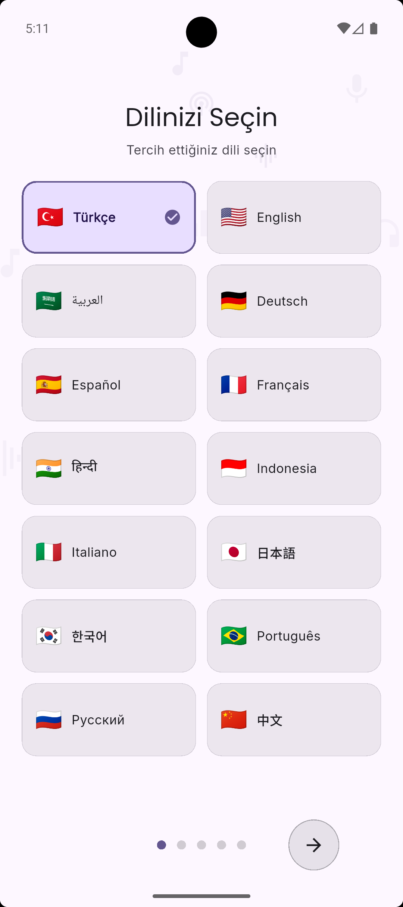
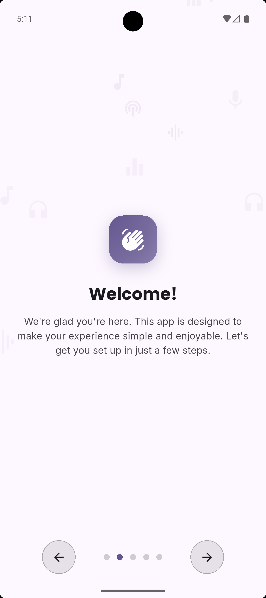
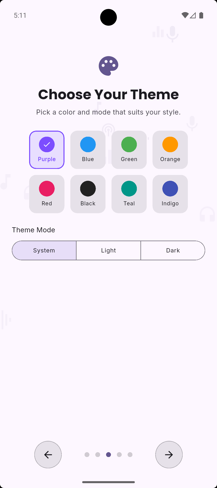
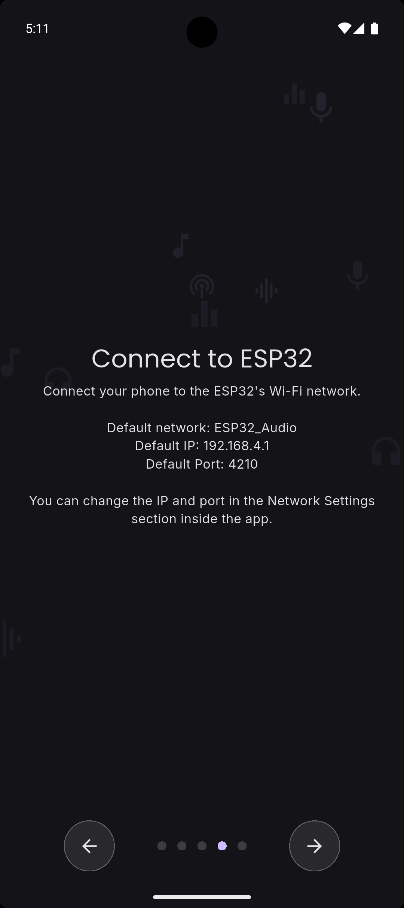
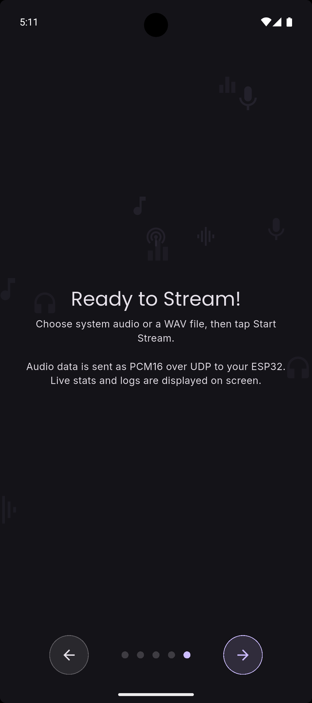
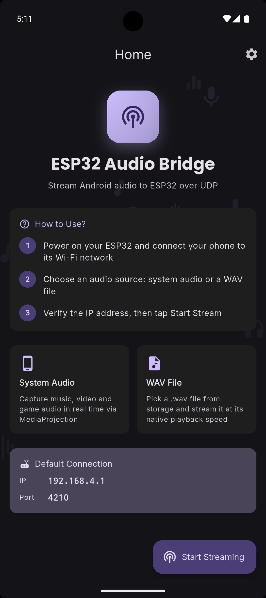
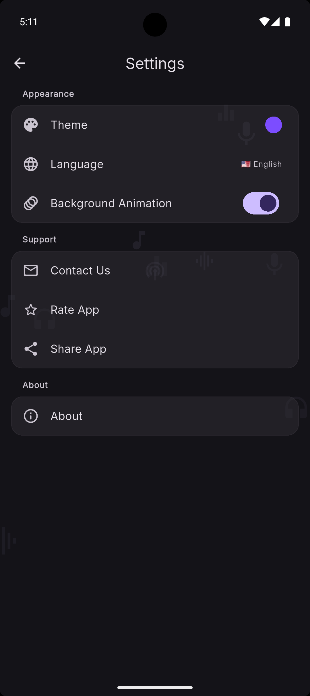
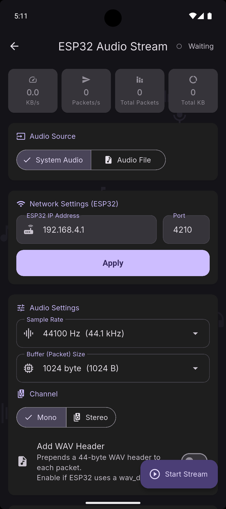
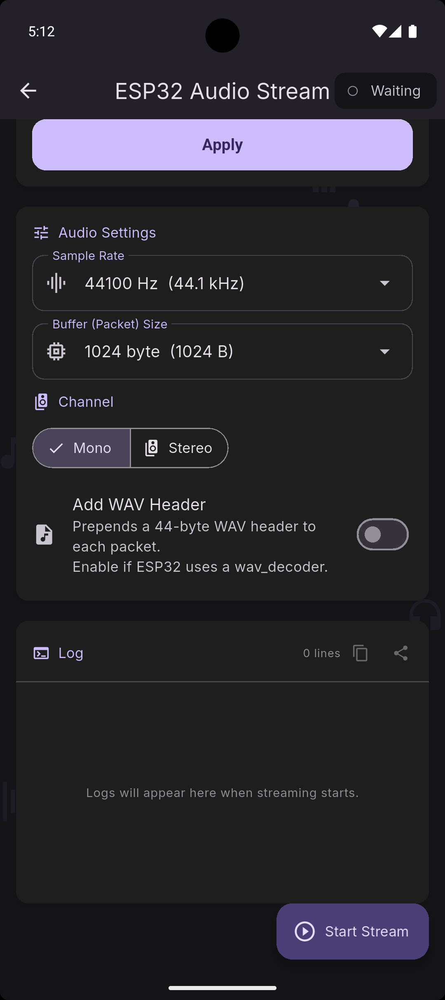

# ESP32 Audio Bridge

Stream Android system audio or WAV files to an ESP32 over UDP — in real time.

The app captures audio via Android's **MediaProjection API** (system audio) or reads a local **.wav file**, then sends raw **PCM16** packets over **UDP** to your ESP32. Live stats and a timestamped log are displayed on screen while streaming.

---

## Screenshots

  
  
  
  
  

  
  
  
  

---

## How It Works

1. Power on your ESP32 and connect your phone to its Wi-Fi network (`ESP32_Audio`)
2. Open the app and choose an audio source — **System Audio** or **WAV File**
3. Verify the IP address (`192.168.4.1`) and port (`4210`)
4. Tap **Start Stream** — audio data is sent as PCM16 over UDP

The ESP32 receives packets on its UDP socket and feeds them to a DAC or I2S audio output. If your ESP32 firmware uses a `wav_decoder`, enable the **Add WAV Header** toggle so each packet includes a 44-byte WAV header.

---

## Features

- **System Audio streaming** via Android MediaProjection (Android 10+ required)
- **WAV file streaming** — pick any `.wav` file and stream at native playback speed, with optional loop
- Configurable **sample rate**, **buffer size**, **channel** (mono/stereo), and **WAV header** toggle
- **Network settings** — change ESP32 IP and port at runtime
- Live **stats panel**: KB/s, Packets/s, Total Packets, Total KB
- Timestamped **log panel** with copy and share buttons
- 14-language support (TR, EN, DE, AR, ES, FR, HI, ID, IT, JA, KO, PT, RU, ZH)
- Multiple color themes + system/light/dark mode

---

## Requirements

| Requirement | Detail |
|---|---|
| Android | 10 (API 29) or higher |
| Permission | MediaProjection (system audio only) |
| Network | Phone connected to ESP32's Wi-Fi AP |

---

## Default Connection

| Setting | Value |
|---|---|
| Wi-Fi Network | `ESP32_Audio` |
| ESP32 IP | `192.168.4.1` |
| UDP Port | `4210` |

These are the ESP32 AP-mode defaults. Both IP and port can be changed in the app's Network Settings screen.

---

## Tech Stack

| Category | Package |
|---|---|
| State Management | flutter_bloc, freezed |
| Dependency Injection | get_it |
| Routing | go_router, go_router_builder |
| Localization | easy_localization |
| Cache | hive_ce, shared_preferences |
| Audio (system) | Android MediaProjection (platform channel) |
| Audio (file) | WAV file streamer (Dart) |
| Networking | UDP socket (dart:io) |
| Sharing | share_plus |
| Code Generation | build_runner, freezed, json_serializable, flutter_gen_runner |

---

## Documentation

| File | Content |
|---|---|
| [`doc/esp32_audio_bridge.md`](doc/esp32_audio_bridge.md) | Full technical reference — architecture, audio pipeline, cubit, services |
| [`doc/localization.md`](doc/localization.md) | Adding/updating translations, generator command |
| [`doc/project.md`](doc/project.md) | Project architecture overview |
| [`doc/new_feature/setup_after_clone.md`](doc/new_feature/setup_after_clone.md) | Post-clone setup steps |

---

## License

MIT — free to use and modify.
